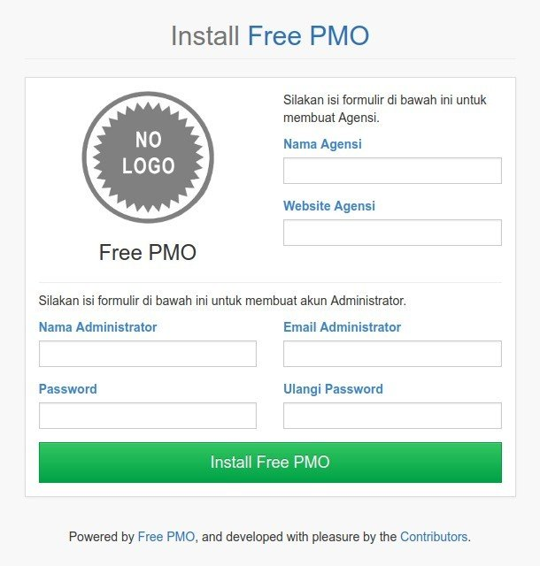
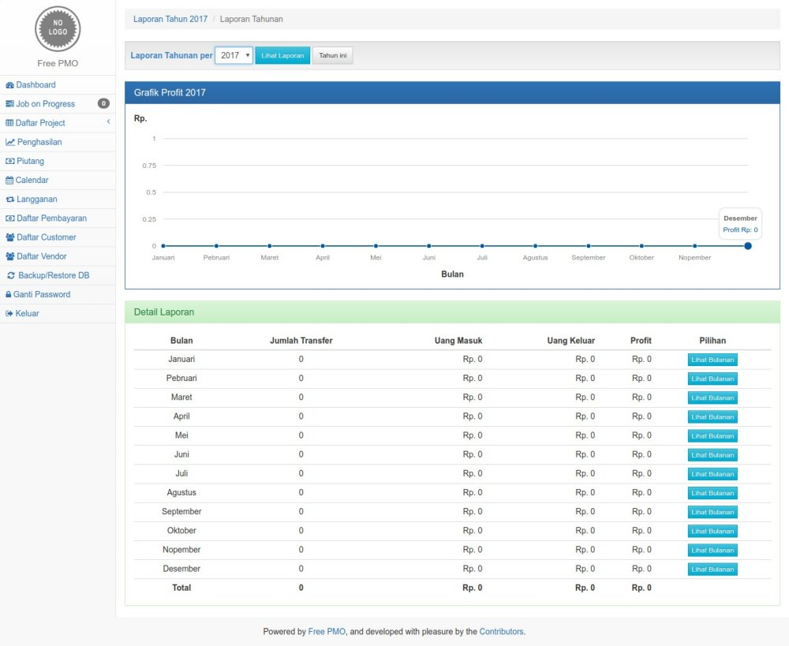

# Free PMO
> *Tell our clients that we are managing our projects professionally.*

[](https://travis-ci.org/nafiesl/free-pmo)
[](https://styleci.io/repos/111558421)

Free PMO (Project Management Office), software management project untuk *freelancer* dan agensi, dibangun dengan Framework **Laravel 5**.

### Daftar Isi
1. [Tentang Free PMO](#tentang)
2. [Tujuan](#tujuan)
3. [Cara Install](#cara-install)
    - [Spesifikasi yang Dibutuhkan](#spesifikasi-minimum-server)
    - [Tahap Install](#tahap-install)
4. [Developer dan Kontributor](#developer-dan-kontributor)
5. [Ingredients (Ramuan)](#ramuan)
6. [Lisensi](#license)
7. [Cara Berkontrobusi](#cara-berkontribusi)
8. [Screenshots](#screenshots)

***

## Tentang

**Free PMO** adalah software yang bertujuan untuk mempermudah pengelolaan dan monitor project. Software ini cocok untuk *Freelancer* dan Agensi/*Software House*, atau perusahaan yang memiliki layanan *project based* kepada customernya.

**Free PMO** terdiri dari dua kata, yaitu *Free* dan *PMO*.
1. **Free** bisa jadi singkatan dari **Freelancer**, bisa juga **Free Software** (merdeka), dan tentunya **Free (gratis)**.
2. **PMO** singkatan dari ***Project Management Office***, ibarat kantor untuk pengelolaan project.

Fitur utama Free PMO adalah pengelolaan project dan transaksi pembayaran setiap project. Fitur-fitur lain software ini tertuang dalam file [konsep](CONCEPT.id.md).

## Tujuan

Tujuan utama Free PMO adalah membantu pengelolaan data project dengan mudah dan profesional.

## Cara Install
Aplikasi ini dapat dipasang dalam server lokal (PC/Laptop) dan server online, dengan spesifikasi berikut :

#### Spesifikasi minimum server
1. PHP >= 7.3 (dan memenuhi [server requirement Laravel 8.x](https://laravel.com/docs/8.x/deployment#server-requirements)),
2. MySQL atau MariaDB,
3. SQlite (untuk automated testing).

#### Tahap Install

1. Clone Repo, pada terminal : `git clone https://github.com/nafiesl/free-pmo.git`
2. `$ cd free-pmo`
3. `$ composer install`
4. `$ cp .env.example .env`
5. `$ php artisan key:generate`
6. Buat database pada MySQL untuk aplikasi ini
7. Setting database pada file `.env`
8. `$ php artisan migrate`
9. `$ php artisan storage:link`
10. `$ php artisan serve`
11. Kunjungi web : `http://localhost:8000/app-install`
12. Isi formulir installasi.
13. Selesai, Anda akan login sebagai admin.




## Developer dan Kontributor

Project ini dikembangkan oleh [Nafies Luthfi](https://github.com/nafiesl) dan para [kontributor](https://github.com/nafiesl/free-pmo/graphs/contributors).

## Ramuan

Free PMO dibangun menggunakan [metode TDD](https://blog.nafies.id/laravel/testing-laravel-tentang-automated-testing) dengan bahan dan dukungan dari paket-paket berikut ini :

##### Dependencies
* [Framework Laravel](https://laravel.com/docs/8.x) (versi 5.2 s/d 8.x).
* [luthfi/formfield](https://github.com/nafiesl/FormField), Wrapper Form dari [laravelcollective/html](https://github.com/laravelcollective/html) dengan Bootstrap 3.
* [riskihajar/terbilang](https://github.com/riskihajar/terbilang), membuat angka terbilang (pada fitur cetak kuitansi) dan romawi.

##### Dev Dependencies

* [PHPUnit](https://github.com/sebastianbergmann/phpunit), PHP testing framework.
* [laravel/browser-kit-testing](https://github.com/laravel/browser-kit-testing), paket browserkit testing untuk Laravel ^5.4.
* [luthfi/simple-crud-generator](https://github.com/nafiesl/SimpleCrudGenerator), CRUD generator berupa artisan command untuk mempercepat workflow TDD.
* [johnkary/phpunit-speedtrap](https://github.com/johnkary/phpunit-speedtrap), pengecekan testing yang lambat (karena query atau proses yang kurang efektif).

##### Frontend

* [Start Bootstrap - SB Admin 2](https://startbootstrap.com/template-overviews/sb-admin-2), Admin template.
* [Bootstrap v3.3.6](https://getbootstrap.com/docs/3.3/)
* [Font Awesome 4.6.3](http://fontawesome.io/cheatsheet)
* [select2](https://github.com/select2/select2)
* [rangeslider.js](http://rangeslider.js.org)
* [FullCalendar](https://fullcalendar.io)
* [morris.js](http://morrisjs.github.io/morris.js), Grafik laporan pendapatan tahunan dan bulanan.

## Lisensi

Project Free PMO merupakan software free dan open source di bawah [lisensi MIT](LICENSE).

## Cara Berkontribusi

Jika ingin berkontribusi terhadap project ini, baik untuk membuat *Issue*, usulan Fitur tambahan, *Pull Request*, maupun donasi, silakan melihat [panduan kontribusi](CONTRIBUTING.md).

## Screenshots

#### Dashboard


#### Detail Project


#### List Job Project


#### Detail Job Project


#### Laporan Tahunan


#### Automated Testing

```bash
$ php artisan test --parallel
```


