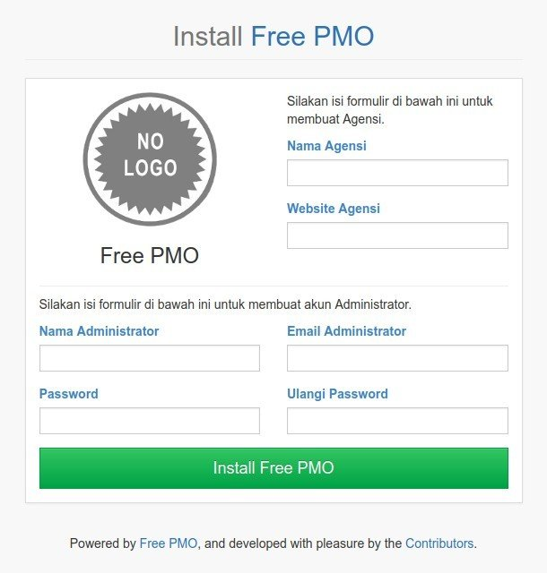
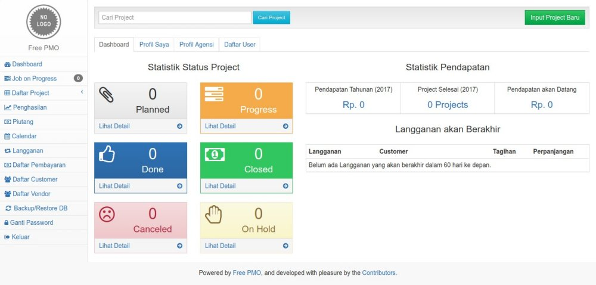
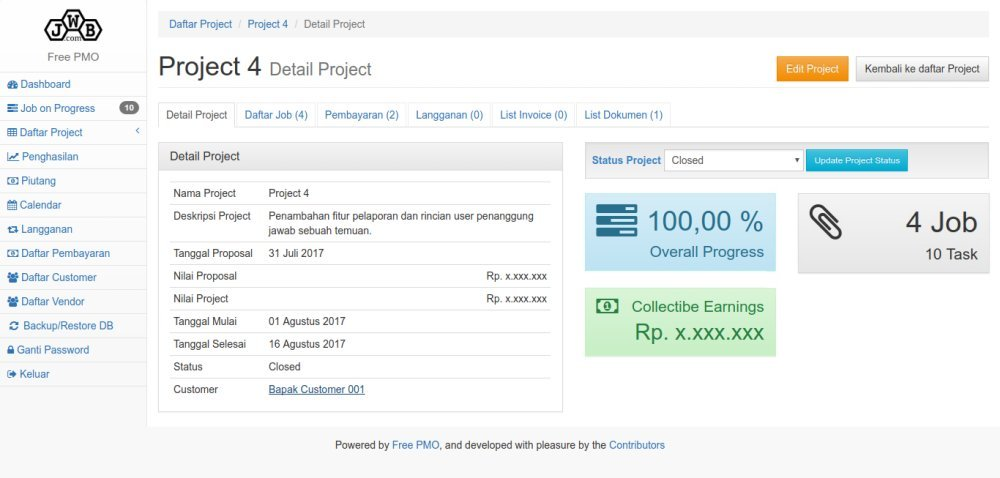
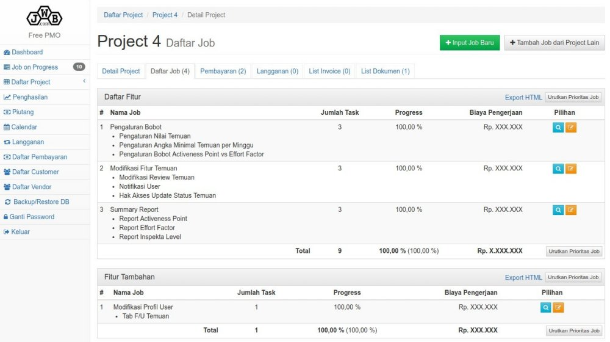
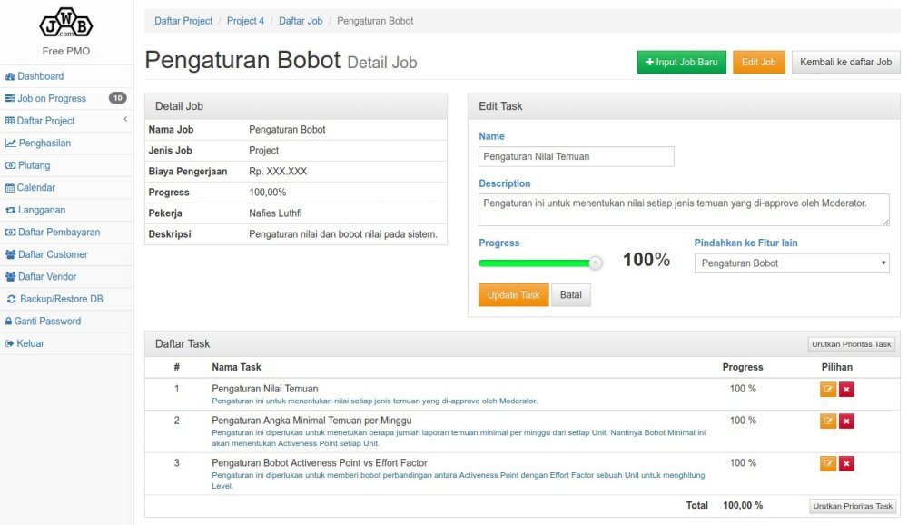
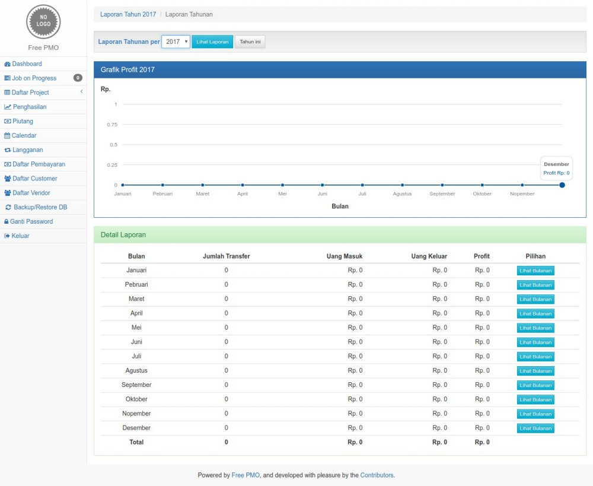
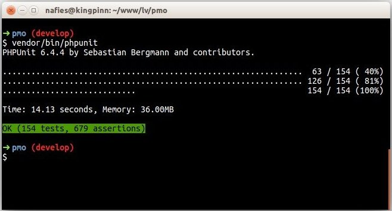

# Free PMO
> *Tell our clients that we are managing our projects professionally.*

[](https://travis-ci.org/nafiesl/free-pmo)
[](https://styleci.io/repos/111558421)

Free PMO (Project Management Office), management project software for *freelancer* and agency, built with **Laravel 5** Framework.

> [Baca versi Bahasa Indonesia](README.id.md)

### Content
1. [About Free PMO](#about)
2. [Goals](#goals)
3. [Getting Started](#getting-started)
    - [Server Requirements](#server-requirements)
    - [Installation Steps](#installation-steps)
4. [Maintainers and Contributors](#maintainers-and-contributors)
5. [Ingredients](#ingredients)
6. [License](#license)
7. [Contributing](#contributing)
8. [Screenshots](#screenshots)

***

## About

**Free PMO** is a project management and project monitoring software. This software is suitable for Freelancer or Agencies, or any company that has project based services for thier customers.

**Free PMO** consists of two words, *Free* and *PMO*.
1. **Free** can be stands for **Freelancer**, or **Free Software**, and off course **Free (of charge)**.
2. **PMO** stands for ***Project Management Office***, like office of project management activities.

Main features on Free PMO are project management and project payment trasanctions. Other features are explaied on this [concept](CONCEPT.md) file.

## Goals

Free PMO was built for easy and professional project management.

## Getting Started
This application can be installed on local server and online server with these specifications :

#### Server Requirements
1. PHP >= 7.3.0 (and meet [Laravel 8.x server requirements](https://laravel.com/docs/8.x/deployment#server-requirements)),
2. MySQL or MariaDB database,
3. SQlite (for automated testing).

#### Installation Steps

1. Clone the repo : `git clone https://github.com/nafiesl/free-pmo.git`
2. `$ cd free-pmo`
3. `$ composer install`
4. `$ cp .env.example .env`
5. `$ php artisan key:generate`
6. Create new MySQL database for this application
7. Set database credentials on `.env` file
8. `$ php artisan migrate`
9. `$ php artisan storage:link`
10. `$ php artisan serve`
11. Visit `http://localhost:8000/app-install` via web browser
12. Fill out the forms
13. Done, you are logged in as Administrator.




## Maintainers and Contributors

This project maintained by [Nafies Luthfi](https://github.com/nafiesl) and developed by [contributors](https://github.com/nafiesl/free-pmo/graphs/contributors).

## Ingredients

Free PMO built with [TDD metode](https://blog.nafies.id/laravel/testing-laravel-tentang-automated-testing) with these ingredients support :

##### Dependencies
* [Framework Laravel](https://laravel.com/docs/8.x) (version 5.2 to 8.x).
* [luthfi/formfield](https://github.com/nafiesl/FormField), Bootstrap 3 Form Wrapper for [laravelcollective/html](https://github.com/laravelcollective/html).
* [riskihajar/terbilang](https://github.com/riskihajar/terbilang), create indonesian in-word number (for payment receipt) and roman numeral.

##### Dev Dependencies

* [PHPUnit](https://github.com/sebastianbergmann/phpunit), PHP testing framework.
* [laravel/browser-kit-testing](https://github.com/laravel/browser-kit-testing), browserkit testing package for Laravel ^5.4.
* [luthfi/simple-crud-generator](https://github.com/nafiesl/SimpleCrudGenerator), CRUD generator artisan command for faster TDD Workflow.
* [johnkary/phpunit-speedtrap](https://github.com/johnkary/phpunit-speedtrap), checks for slow testing (because of ineffective query or proccess).

##### Frontend

* [Start Bootstrap - SB Admin 2](https://startbootstrap.com/template-overviews/sb-admin-2), Admin template.
* [Bootstrap v3.3.6](https://getbootstrap.com/docs/3.3/)
* [Font Awesome 4.6.3](http://fontawesome.io/cheatsheet)
* [select2](https://github.com/select2/select2)
* [rangeslider.js](http://rangeslider.js.org)
* [FullCalendar](https://fullcalendar.io)
* [morris.js](http://morrisjs.github.io/morris.js), yearly and monthly earning report graph.

## License

Free PMO Project is a free and open-source under [MIT license](LICENSE).

## Contributing

If you want to contribute to this project, by creating *Issue*, new feature proposal, *Pull Request*, or donation, please see this [contributing guidelines](CONTRIBUTING.md).

## Screenshots

#### Dashboard


#### Project Detail


#### Project Job List


#### Project Job Detail


#### Yearly Report


#### Automated Testing

```bash
$ php artisan test --parallel
```


